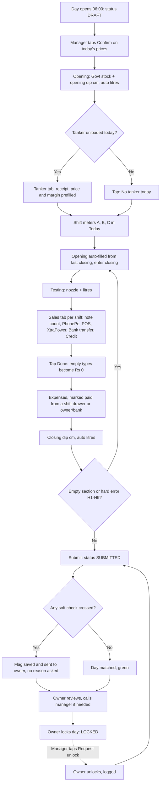
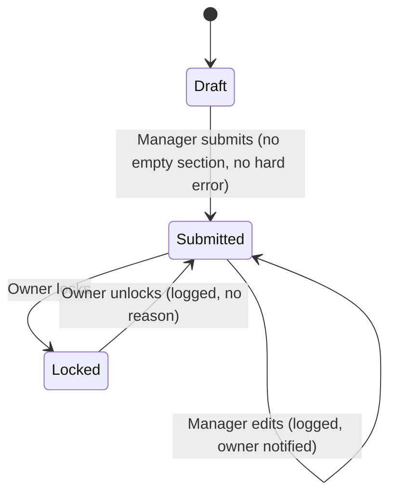
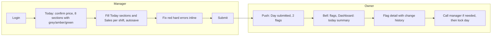
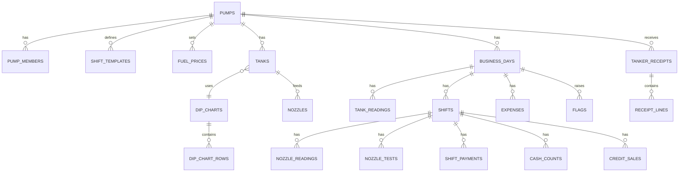

# PRD: PumpHisaab v1.1 (Daily Entry, Real-Time Reconciliation, Leak Flags)

**Brand:** PumpHisaab (pumphisaab.com) | **Tagline:** Sara hisaab ek jagah
**Owner:** Subham | **Pilot site:** Shree Lokanath Filling Station (IOCL), Dhenkanal, Odisha | **Status:** v1.1, ready for build | **Date:** 25 Sep 2026

### What changed from v1
- **Navigation:** Manager tabs are Today, Sales, Tanker, Profile. Owner adds Dashboard. Alerts live behind a bell icon (top right), not a tab.
- **No reason prompts anywhere.** Soft checks save and raise a Flag to the owner; the "why" is handled on a call. Unlock request and unlock need no reason. H2 meter change keeps owner approval, without a reason. Everything is still logged.
- **Prices:** set only by the owner (Profile > Fuel prices, with a start date). The manager only taps **Confirm** on Today.
- **Sales tab** holds all money in: Cash, PhonePe, POS, XtraPower, Bank transfer, Credit, one total per type per shift (no per-machine boxes). Cash is entered as a **note count** that auto-totals. Views: By type and By shift.
- **Sales "Done" per shift:** tapping Done fills every empty type with ₹0. A shift's Sales is complete only when every type has a value (₹0 allowed).
- **Expenses** are a Today section. Cash paid from a shift drawer is added back to that shift's money match.
- **Testing** = nozzle + litres only. Test dips and the test-return check (old S5) are dropped: 0.1 cm of dip is about 11 L, so it cannot check a 5 L test.
- **Tanker** price and margin are prefilled from the last tanker.
- **Today** has 8 sections plus a price Confirm strip. Not-started sections show a grey circle, not red.
- **Pump words, not accounting words:** Should have / Received, Sold as per tank / Sold as per meters, Difference, Flag.
- **Pump setup locked:** 1 MS + 1 HSD tank, both 20 KL horizontal with the same IOCL chart (full tank = 21,628.93 L at 210 cm). 4 HSD + 4 MS nozzles. Shifts A 6am-2pm, B 2pm-10pm, C 10pm-6am (configurable). Business day starts 6 AM.
- **Sign rule:** a negative Difference always means a loss.
- **Added after v1.1 (25 Sep 2026, from the final design canvas):** owner notes on a section, "submit yesterday first", and "None today" buttons on unused payment types. Details in `docs/decisions.md` (D3).
- **Changed after the real notebook day (26 Sep 2026):** book-stock check S3 compares the day-to-day change in the gap; tanker short is taken off received; cash counted includes opening cash; payment types are Cash, Paytm, Card, XtraPower, Bank transfer, Credit; credit slips in ₹ or litres; customer payments kept out of sales; expense types extended. See `docs/decisions.md` D21-D33 — they override the matching lines below. Visuals: `docs/design/canvas/` is final and wins over the design-system component notes (D2).

---

## Goal
Make every litre and every rupee at the pump match on the same day by replacing ~10 manual notebooks with one guided mobile entry flow that auto-calculates, auto-reconciles and flags leaks the moment they happen. Success = 90% of days fully matched and closed the same day within 3 months of launch.

## Objective
Build a mobile-first app (Android + web, one Expo codebase) where pump managers enter daily stock, dips, tanker receipts, shift-wise meter readings, testing, money received by type, credit sales and expenses. The system converts dip cm to litres from the uploaded tank chart, runs a 3-way match (sold as per tank vs sold as per meters vs money received) per shift and per day, blocks hard errors at entry, flags soft issues to the owner, and logs every change. The owner gets a daily summary and locks each day. The data model is multi-pump from day one so the product can be sold as a SaaS subscription after a 2 to 3 month pilot.

## Problem Statement
**Head problem:** Leaks in stock and cash are found days after they happen, if at all, because the books are kept in ~10 notebooks and reconciled by hand. By the time a mismatch is spotted (often ~10 days later), nobody can say which shift, manager or step caused it.

**Underlying problems (biggest impact first):**
1. **Late detection.** No same-day match of tank stock vs meter sales vs money received.
2. **Human calculation errors.** Dip conversion, meter subtraction, rate multiplication and totals are done by hand, so honest mistakes and manipulation look the same.
3. **Collection leaks.** Money types are recorded separately with no per-shift tie-back to litres dispensed.

## User Persona and Pain Points
- **Pump Manager (enters data).** Comfortable with apps. **Pain:** ~45 to 60 minutes a day of writing and arithmetic (assumption, measured in pilot); errors surface ~10 days later with no proof of who wrote what.
- **Pump Owner (audits).** Visits periodically, carries the financial risk. **Pain:** no dashboard, no same-day variance view, no audit trail; stock variance beyond IOCL limits is a compliance risk.

## Background / As-Is
- ~10 physical notebooks plus some Excel sheets; dips converted using the printed IOCL chart; totals by hand; reconciliation late and irregular.
- Day-by-day historical data exists and will be used for testing (1 week entered from photos) and for a 1-month parallel run.

## Analysis

### Market sizing
| Layer | Definition | Number | Source / assumption |
|---|---|---|---|
| TAM | All fuel retail outlets in India | 1,00,266 (end Nov 2025) | PPAC data via Deccan Chronicle, Dec 2025 |
| SAM | PSU OMC dealer-run outlets | ~90,000 | PPAC; IOCL alone 41,664 |
| SOM (3 yrs) | 0.5% of SAM, starting Odisha | ~450 pumps | Assumption |
| Revenue at SOM | 450 x ₹600/month | ~₹32 lakh ARR | Assumption |

### Pilot value
- HSD target ~200 KL/month; at an assumed ~₹90/L that is ~₹1.8 Cr/month. A 0.3% undetected leak = ~600 L = ~₹54,000/month (assumption; baseline measured in pilot).

### Benchmarks used for tolerances
- IOCL MDG: normal operational stock variation ±4% of tank stock; evaporation allowance MS 0.75% / 0.60%, HSD 0.25% / 0.20% (up to / above 600 KL annual average).
- The IOCL chart itself notes physical readings may vary ±4% from the mathematical chart.
- **Implication:** ±4% is a compliance ceiling, not a leak detector. PumpHisaab uses tighter owner-set thresholds (default 0.5% stock, ₹100 cash per shift) and uses the IOCL limit only for a red compliance flag.

### Competitive analysis
| Product | Positioning | Price | Gap we exploit |
|---|---|---|---|
| PumpOne | Accounting + billing ERP with shift shortage slips | On request | Heavy ERP; leak detection is one of many modules |
| PetroByte | Cloud accounting + mobile, Tally export | ₹3,990 to ₹8,990/year | Accounting-first, not a guided daily entry flow |
| Petrosoft | ERP, 90+ reports, 4 apps | On request | Complexity |
| Others (PetroMunimji, PetroTally, KGM, PumpCount) | Accounting / billing | Varies | Often reported as hard to navigate |

**Positioning:** same-day leak detection with a checklist UX a manager finishes in under 20 minutes, priced in the ₹300 to ₹750/month band.

## What's Not in Current Scope
- Full owner dashboards (v1 has the daily summary only; full dashboards after 30+ days of data).
- Credit ledger, recovery and ageing (credit sales are stored in structured form for v2).
- Lubes and other products; density register; bank deposit reconciliation; staff attendance and salary.
- Per-machine POS / PhonePe tracking (one total per type per shift).
- Photo proof; mid-shift price change; offline-first sync (only local drafts); languages other than English.
- iOS app, OTP / Google login, WhatsApp / SMS alerts, web push.
- IOCL automation import, Tally / GST export, SaaS self-onboarding and billing.

## Functional Requirements

### Business day and shifts
- A business day runs from the pump's day start time (default **06:00 IST**) to the same time next day.
- Default shifts: **A 06:00-14:00, B 14:00-22:00, C 22:00-06:00**. Shift C belongs to the business day it started in.
- Shift count and timings are owner-configurable in setup. A change applies **from the next business day only**; past days are never recalculated.

### Flow Chart and User Journey

**System flow: one business day**

**Day status**

**User journey**

### Features Overview and Scope

#### F1. Setup (Owner, Profile > Pump settings)
- **Pump:** name, OMC, address, day start time (default 06:00).
- **Shifts:** list of shifts with start/end times, effective from a date.
- **Tanks:** label, product (MS/HSD), linked dip chart. Capacity = the chart's maximum volume (e.g. 21,628.93 L), never the nominal 20 KL. Pilot: MS-1 and HSD-1, same 20 KL chart. More tanks can be added later (additional HSD tank requested from IOCL).
- **Dip chart upload:** Excel/CSV with `dip_cm`, `volume_litres`. Validation: numeric, both columns strictly increasing, duplicates removed, 0 cm = 0 L added if missing. Preview before save. Linear interpolation between rows (equal to using the chart's litres-per-mm column).
- **Nozzles:** label, product, linked tank, active. Pilot: HSD-A to D, MS-A to D.
- **Staff (attendants), credit customers, expense categories** (Salary, Tiffin, Bakshis, Other).
- **Payment types:** Cash, PhonePe, POS, XtraPower, Bank transfer, Credit (renamable; Cash and Credit are system types).
- **Cash denominations:** ₹500, ₹200, ₹100, ₹50, ₹20, ₹10 notes + coins total (editable list).
- **Fuel prices:** product, ₹/L, start date. Only the owner can add a price. The price used for a day is the latest price with start date ≤ that business day.
- **Tolerances:** stock difference % (default 0.5%), money difference per shift (₹100), Govt vs dip opening (0.5%), tanker short (0.3% of ordered), opening vs yesterday closing (0.5 cm).
- **Users:** create manager (username + password); roles Owner, Manager.

#### F2. Today (Manager home)
- Header: date, day status pill, bell icon with unread count (top right).
- **Price Confirm strip:** shows today's MS and HSD ₹/L; manager taps **Confirm**. Hard: nothing money-related is calculated until confirmed. If the price looks wrong, the manager calls the owner (no edit option).
- **8 sections**, each with status: grey circle (not started), amber (in progress), green tick (done), red count badge (hard errors):
  1. Opening stock and dip
  2. Tanker (received today, or "No tanker today")
  3. Shift A meters and testing
  4. Shift B meters and testing
  5. Shift C meters and testing
  6. Sales (done when all shifts are Done in the Sales tab; tapping opens Sales)
  7. Expenses (done when at least one expense is added or "No expenses today" is tapped)
  8. Closing dip
- Progress label "5 of 8 done". **Submit** is enabled when all 8 are done and there are zero hard errors.
- **Autosave** on leaving every field; indicator Saved / Saving / Offline, will retry. Local draft kept if the network drops.

#### F3. Opening stock and dip (per tank)
| Field | Type | Rule |
|---|---|---|
| Opening stock as per Govt report (L) | Number | Required |
| Opening dip (cm) | Number, 1 decimal | Required, within chart |
| Opening dip (L) | Auto | From chart |
| Difference vs Govt (L, %) | Auto | Flag S3 if over tolerance |
- Shows "Yesterday closed at 128.5 cm" as reference; flag S7 if different by more than tolerance.

#### F4. Tanker (tab + pulled into Today)
Per receipt: vehicle number, order date, unload date (default today); per product: quantity ordered (L), short (L), price/L and profit/L (**prefilled from the last tanker**, editable); optional dip before and after decantation.
| Output | Formula |
|---|---|
| Received net (L) | Ordered minus Short |
| Amount (₹) | Ordered x Price/L |
| Short amount (₹) | Short x Price/L |
| Total amount (₹) | Σ product amounts |
| Total sales amount (₹) | Total amount minus Σ short amounts |
| Total profit (₹) | Σ (Received net x Profit/L) |
| Decantation gain (L) | Dip after L minus Dip before L (if dips given) |
- Today pulls HSD/MS ordered, short and received net for receipts with unload date in that business day. Flag S6 if short > tolerance or decantation gain differs from received net by more than 0.5%.

#### F5. Shift meters and testing (Today, one section per shift)
- **Attendants:** chips from staff list (at least 1).
- **Meter readings:** one compact row per active nozzle: opening (auto from previous shift's closing, shown small), closing (input), sold (auto).
- **Changing an opening** (meter reset/repair): allowed only via "Meter changed" action; saves as **pending owner approval** (H2) and blocks submit until approved. No reason field.
- **Testing:** toggle "Testing done"; rows of nozzle + litres (default 5). Test litres are deducted from meter sales because the fuel is poured back into the tank.

#### F6. Sales tab (all money in)
- Shift picker A/B/C (defaults to current shift). For the selected shift:
  - **Cash:** note-count grid (₹500 x n, ₹200 x n ... + coins ₹). Blank counts as 0. Running total shown.
  - **PhonePe, POS, XtraPower, Bank transfer:** one ₹ total each.
  - **Credit:** list of credit slips for the shift (see F7); total shown.
  - **Done** button: fills every empty type with ₹0 and marks the shift's Sales done. Editing afterwards is allowed (logged).
- **By shift view:** each shift shows Should have ₹, Received ₹ (incl. credit and cash expenses paid from that drawer), Difference ₹ with matched/not matched state.
- **By type view:** totals per payment type for the day, split by shift.

#### F7. Credit sales (inside Sales, Credit type)
| Field | Type | Rule |
|---|---|---|
| Shift | Auto from Sales shift picker | Required |
| Company name | Searchable + add new | Required |
| Vehicle number | Text, uppercase | Required |
| Memo/slip number | Text | Required, unique per pump (H7) |
| Fuel | HSD/MS, default HSD | Required |
| Volume (L) | Number | Required, > 0 |
| Rate (₹/L) | Auto from today's price, read-only | |
| Amount (₹) | Auto = Volume x Rate | |

#### F8. Expenses (Today section)
| Field | Type | Rule |
|---|---|---|
| Category | Salary, Tiffin, Bakshis, Other | Required |
| Type | Fixed / Variable (default from category) | Required |
| Description | Text | Required if Other |
| Date | Default today | Required |
| Amount (₹) | Number | Required, > 0 |
| Paid from | Shift A drawer, Shift B drawer, Shift C drawer, Owner, Bank | Required; drawer cash is added back to that shift's Received |
- "No expenses today" button completes the section.

#### F9. Closing dip (per tank)
- Closing dip cm, auto litres. Hard error if outside the chart.

#### F10. Calculation engine
**Per shift (money):**
- Sold as per meters L (shift, product) = Σ(Closing minus Opening) minus Test litres
- **Should have ₹** = Σ Sold as per meters L x Price
- **Received ₹** = Cash (note count) + PhonePe + POS + XtraPower + Bank transfer + Credit + Cash expenses paid from this shift's drawer
- **Difference ₹ = Received minus Should have** (negative = short, positive = excess)

**Per day, per product (litres):**
- **Sold as per tank L** = Opening dip L + Received net L minus Closing dip L
- **Sold as per meters L** = Σ shifts
- **Difference L = Sold as per meters minus Sold as per tank** (negative = more fuel left the tank than the meters show = possible loss). Difference % = Difference L / Sold as per tank L.

**Display rule:** negative always means loss, shown red with a true minus sign (−₹1,250, −42 L); positive is excess, amber; zero is green "Matched".

A day is **Matched** when every product's Difference % and every shift's Difference ₹ are within tolerance and no hard error exists.

**Number handling:** all money and litre maths uses exact decimal arithmetic (no floating point). Money rounded to 2 decimals, half-up, only at display; totals from unrounded values.

#### F11. Checks
**Hard (block that save or block submit):**
| Code | Rule |
|---|---|
| H1 | Closing meter < opening |
| H2 | Opening ≠ previous closing without an owner-approved "Meter changed" |
| H3 | Dip cm outside chart, or dip litres > tank capacity |
| H4 | Any Today section not done at submit |
| H5 | Negative amount, count or volume |
| H6 | Price not confirmed for the day |
| H7 | Duplicate credit slip number |
| H8 | Test litres > meter sales of that nozzle in that shift |
| H9 | Credit litres in a shift > meter litres of that product in that shift |

**Soft (save normally, raise a Flag to the owner, no reason asked):**
| Code | Rule | Default |
|---|---|---|
| S1 | Stock Difference % per product | beyond ±0.5% |
| S2 | Shift money Difference | beyond ±₹100 |
| S3 | Govt opening vs dip opening | beyond 0.5% |
| S4 | Active nozzle sold 0 L, or > 2x its 7-day average | n/a |
| S6 | Tanker short or decantation mismatch | > 0.3% / 0.5% |
| S7 | Opening dip vs yesterday's closing dip | > 0.5 cm |
| S8 | Any edit after submit | always |
| S9 | Expense category above daily cap (if set) | owner-set |
| R1 | Stock Difference beyond IOCL limit (compliance) | ±4% + evaporation allowance |
(S5 removed in v1.1.)

#### F12. Submit
- Enabled only when all 8 Today sections are done and zero hard errors exist. On submit: status Submitted, timestamp, push to owner: "Day matched" or "HSD −42 L, Shift B −₹1,250, 2 flags".

#### F13. Owner review, flags and locking
- **Bell (top right):** flags list (Open / Seen), each with the value, shift, who entered, and the change history.
- **Dashboard (owner tab):** today's summary (matched per product and shift), 30-day calendar (green matched same day, amber matched late, red not matched, grey not submitted), open flags count.
- **Approve meter change** (H2) from the flag.
- **Lock day.** Manager can tap **Request unlock** on a locked day (no reason); owner taps **Unlock** (no reason). Both logged.

#### F14. Audit log
- Every table stores created_by/at and updated_by/at. Database triggers write every insert, update and delete to `audit_log` with old and new values, user, time and day status. No screen can bypass it.

#### F15. Notifications
- Android push only (web shows the bell). To owner: day submitted, flag raised, edit after submit, meter change needs approval, unlock requested, day not submitted by 09:00 next day. To manager: meter change approved, day unlocked, sections pending 30 minutes before day end.

#### F16. Auth and roles
- Username + password (Supabase Auth with hidden email `username@pumphisaab.app`). Owner creates manager logins through a secure server function.
- `pump_members` links users to pumps with a role. Row Level Security on every table by pump. Manager: edit own pump's unlocked days. Owner: everything plus settings, prices, approvals, lock/unlock, audit.

### UI/UX Scope
- **Platform:** Expo app for Android + web (Safari/Chrome; "Add to Home Screen" on iPhone). Entry screens max 480 px wide on web; left rail instead of bottom nav at ≥1024 px.
- **Bottom nav:** Manager: Today, Sales, Tanker, Profile. Owner: Today, Sales, Tanker, Dashboard, Profile. Bell icon top right on every tab.
- **Design:** PumpHisaab design system and flow canvas in Claude Design (deep teal accent, Inter tabular numbers, auto light/dark, HSD slate-blue / MS plum tints, compact meter rows, signed red/amber/green differences). The canvas + tokens JSON are the visual source of truth; this PRD is the behaviour source of truth.
- **Words:** Should have, Received, Sold as per tank, Sold as per meters, Difference, Flag.
- **States on every screen:** empty, loading (skeleton), error with retry, saved.

### Database
All tables have `id` (uuid PK), `pump_id` (FK, used by RLS; except `pumps`), `created_by`, `created_at`, `updated_by`, `updated_at`. Money and litres use `numeric`.

| Table | Key columns |
|---|---|
| `pumps` | name, omc (IOCL/BPCL/HPCL/OTHER), address, day_start_time (06:00), tolerances jsonb |
| `pump_members` | user_id (FK auth), username (unique), full_name, role (OWNER/MANAGER), is_active |
| `shift_templates` | effective_from date, shifts jsonb [{code, name, start, end}] |
| `fuel_prices` | product (MS/HSD), price_per_l numeric(8,2), effective_from date |
| `dip_charts` | name ("20 KL horizontal IOCL"), max_volume_l |
| `dip_chart_rows` | chart_id, dip_cm numeric(6,1), volume_l numeric(10,2); unique (chart_id, dip_cm) |
| `tanks` | label, product, chart_id, capacity_l (= chart max), is_active |
| `nozzles` | label, product, tank_id, is_active |
| `staff`, `credit_customers`, `expense_categories` | name, is_active (+ default_type, daily_cap for categories) |
| `payment_types` | name, kind (CASH/CREDIT/OTHER), sort_order, is_active |
| `cash_denominations` | value (500, 200 ... ), is_active |
| `business_days` | business_date (unique per pump), status (DRAFT/SUBMITTED/LOCKED), price_confirmed_by/at, no_tanker, no_expenses, submitted_by/at, locked_by/at, is_matched |
| `tank_readings` | day_id, tank_id, reading_type (OPENING/CLOSING), govt_stock_l, dip_cm, dip_l |
| `shifts` | day_id, shift_code, starts_at, ends_at, sales_done_at |
| `shift_attendants` | shift_id, staff_id |
| `nozzle_readings` | shift_id, nozzle_id, opening, closing, meter_change_status (NONE/PENDING/APPROVED), approved_by/at |
| `nozzle_tests` | shift_id, nozzle_id, litres (default 5) |
| `shift_payments` | shift_id, payment_type_id, amount_rs (cash row = auto total of counts) |
| `cash_counts` | shift_id, denomination_id, note_count; plus `coins_amount_rs` on the cash payment row |
| `credit_sales` | shift_id, customer_id, vehicle_no, slip_no (unique per pump), product, volume_l, rate, amount_rs |
| `tanker_receipts` | vehicle_no, order_date, unload_date, day_id |
| `receipt_lines` | receipt_id, product, tank_id, qty_ordered_l, short_l, price_per_l, profit_per_l, dip_before_cm, dip_after_cm |
| `expenses` | day_id, category_id, expense_type, description, expense_date, amount_rs, paid_from (SHIFT_A/B/C drawer, OWNER, BANK) |
| `flags` | day_id, shift_id, rule_code, severity (SOFT/COMPLIANCE/APPROVAL), value, message, status (OPEN/SEEN/CLOSED), seen_by/at |
| `unlock_requests` | day_id, requested_by/at, resolved_by/at, status |
| `push_tokens` | user_id, token, platform |
| `audit_log` | table_name, record_id, action, old_values jsonb, new_values jsonb, changed_by, changed_at, day_status_at_change |

Calculations live in database views (`v_shift_match`, `v_day_match`) as the final truth, mirrored by a TypeScript engine for instant on-screen results; both are tested against the same golden cases.

## Acceptance Criteria

**Calculation accuracy (100% pass on a golden set of at least 30 cases, run against both the app engine and the database)**
1. Using the pilot 20 KL chart: 123.0 cm = 13,163.73 L; **123.4 cm = 13,215.37 L** (13,163.73 + 4 mm x 12.91); 210 cm = 21,628.93 L and raises no capacity error.
2. HSD opening dip 12,000 L + received net 9,950 L (ordered 10,000, short 50) minus closing dip 13,955 L = sold as per tank 7,995 L.
3. HSD meters gross 8,005 L minus test 10 L = sold as per meters 7,995 L; Difference 0 L; HSD Matched.
4. MS sold as per meters 1,490 L at ₹101.00 = Should have ₹1,50,490.00. Cash note count 150 x ₹500 + 50 x ₹200 + 40 x ₹100 + coins ₹1,000 = ₹90,000; + PhonePe ₹50,000 + POS ₹5,490 + Credit ₹5,000 = Received ₹1,50,490; Difference ₹0.
5. Tiffin ₹300 paid from Shift A drawer increases Shift A Received by ₹300.
6. Tanker HSD ordered 10,000 L, short 50 L, ₹85.00/L, profit ₹3.00/L: amount ₹8,50,000; short amount ₹4,250; received net 9,950 L; profit ₹29,850.
7. Stock Difference of −42 L on 8,000 L sold as per tank shows "−42 L (−0.53%)" in red and raises S1.
8. Price with start date 1 Oct applies to the 1 Oct business day and later, not to 30 Sep.

**Functional**
9. Shift B opening is prefilled from Shift A closing; changing it creates a pending approval and blocks submit until the owner approves (H2).
10. Closing < opening shows a red error immediately (H1).
11. Duplicate slip number cannot be saved (H7).
12. Tapping Done on a shift's Sales fills every empty type with ₹0 and marks it done.
13. Soft checks never ask for a reason; they save and create a Flag visible to the owner within 1 minute (push on Android).
14. Submit stays disabled until all 8 sections are done and no hard errors remain.
15. Every change writes an audit_log row (verified on 10 random fields).
16. Manager can edit a Submitted day (owner notified); cannot edit a Locked day; can Request unlock; owner Unlock is logged.
17. A manager of Pump X cannot read or write Pump Y data (RLS test).
18. A shift timing change saved today takes effect from the next business day; past days unchanged.
19. Shift C entries made at 02:00 belong to the previous calendar date's business day.
20. Killing the app mid-entry and reopening restores every field saved on blur.

**Performance / usability**
21. Match results update within 1 second of a save on a budget Android phone on 4G.
22. Median manager entry time per day ≤ 20 minutes by week 3 of the pilot.

## Tracking and Instrumentation

### North Star Metric
**% of days fully matched and closed the same day** = days Submitted within 3 hours after the business day ends AND is_matched = true / total business days. Current 0%. Target 70% by month 1, 90% by month 3.

### Sub-Metrics
1. **Same-day submission rate**: current 0%, target 95%.
2. **Match rate of submitted days**: baseline in first 30 days, target 90%.

### Guardrail
**Manager entry time per day** (active time, idle gaps > 2 min excluded): median ≤ 20 min, p90 ≤ 30 min.

### Input and Output Metrics
- **Input:** % fields prefilled or auto (target ≥ 40%), tolerances, reminder timing, taps per shift.
- **Output:** stock Difference per product per day, money Difference per shift, ₹ leakage flagged per month, flags seen within 24 h, edits after submit per week.

### Events
`login_success`, `login_failed`, `day_opened`, `price_confirmed`, `section_opened` {section, shift}, `section_completed` {section, shift, duration_sec}, `sales_done_tapped` {shift, autofilled_types}, `field_autosaved`, `draft_save_failed`, `hard_error_shown` {rule_code}, `flag_raised` {rule_code, severity, value}, `flag_seen` {rule_code, hours_to_seen}, `meter_change_requested`, `meter_change_approved`, `day_submitted` {is_matched, total_entry_sec, open_flags}, `record_edited_after_submit` {table}, `day_locked`, `unlock_requested`, `day_unlocked`, `tanker_receipt_added`, `credit_sale_added`, `expense_added` {paid_from}, `dip_chart_uploaded` {rows}, `fuel_price_added` {product}, `push_opened` {type}

---

## PRD Quality Check
- [x] Goal, head problem, ranked underlying problems, personas
- [x] Non-goals updated for v1.1
- [x] Functional spec aligned with Claude Design decisions and Phase 0 answers
- [x] Database strawman with ERD
- [x] Golden calculation cases using the real pilot dip chart
- [x] Metric tree and events
- [ ] Real leakage baseline (from pilot)

**Score: 9 / 10.** Remaining gap: leakage and entry-time baselines are assumptions until the pilot.
